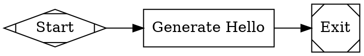

# Attractor 规范实现计划

> **For Claude:** REQUIRED SUB-SKILL: Use superpowers:executing-plans to implement this plan task-by-task.

**目标:** 实现 Attractor - 基于 DOT 的流水线执行器，用于编排多阶段 AI 工作流。

**架构:** Python 包，包含 DOT 解析器、验证器、执行引擎、节点处理器、状态管理、人机协作接口和条件表达式求值器。使用 Pydantic 进行数据验证，asyncio 进行异步操作，支持可插拔的处理器和 LLM 后端。

**技术栈:**
- Python 3.11+
- Pydantic 2.0+ (数据验证)
- pytest (测试)
- anyio (异步运行时)

---

## 项目结构设置

### Task 1: 创建项目骨架

**Files:**
- Create: `attractor-py/pyproject.toml`
- Create: `attractor-py/src/attractor/__init__.py`
- Create: `attractor-py/src/attractor/models/__init__.py`
- Create: `attractor-py/tests/__init__.py`
- Create: `attractor-py/tests/conftest.py`

**Step 1: 创建 pyproject.toml**

```toml
[build-system]
requires = ["hatchling"]
build-backend = "hatchling.build"

[project]
name = "attractor"
version = "0.1.0"
description = "DOT-based pipeline executor for multi-stage AI workflows"
readme = "README.md"
requires-python = ">=3.11"
dependencies = [
    "pydantic>=2.0.0",
    "anyio>=4.0.0",
]

[project.optional-dependencies]
dev = [
    "pytest>=7.0.0",
    "pytest-asyncio>=0.21.0",
    "pytest-cov>=4.0.0",
    "black>=23.0.0",
    "ruff>=0.1.0",
    "mypy>=1.0.0",
]

[tool.hatch.build.targets.wheel]
packages = ["src/attractor"]

[tool.pytest.ini_options]
asyncio_mode = "auto"
testpaths = ["tests"]

[tool.black]
line-length = 100
target-version = ["py311"]

[tool.ruff]
line-length = 100
select = ["E", "F", "I", "W"]

[tool.mypy]
python_version = "3.11"
warn_return_any = true
warn_unused_configs = true
disallow_untyped_defs = true
```

**Step 2: 创建基础目录结构**

Run: `mkdir -p attractor-py/src/attractor/models attractor-py/tests`

**Step 3: 创建 __init__.py 文件**

```python
# src/attractor/__init__.py
__version__ = "0.1.0"
```

**Step 4: 创建测试 conftest.py**

```python
# tests/conftest.py
import pytest

@pytest.fixture
def sample_dot():
    return '''
digraph Simple {
    graph [goal="Run tests and report"]
    rankdir=LR

    start [shape=Mdiamond, label="Start"]
    exit  [shape=Msquare, label="Exit"]

    run_tests [label="Run Tests", prompt="Run the test suite"]
    report    [label="Report", prompt="Summarize results"]

    start -> run_tests -> report -> exit
}
'''
```

**Step 5: Commit**

```bash
cd attractor-py
git add pyproject.toml src/attractor/__init__.py src/attractor/models/__init__.py tests/__init__.py tests/conftest.py
git commit -m "feat: create project skeleton for attractor"
```

---

## 数据模型定义

### Task 2: 定义核心数据模型

**Files:**
- Create: `attractor-py/src/attractor/models/graph.py`
- Create: `attractor-py/tests/models/test_graph.py`

**Step 1: 编写失败的测试 - Graph 模型**

```python
# tests/models/test_graph.py
import pytest
from attractor.models.graph import Graph, Node, Edge

def test_graph_creation():
    graph = Graph(
        id="test",
        goal="Test goal",
        nodes={},
        edges=[]
    )
    assert graph.id == "test"
    assert graph.goal == "Test goal"

def test_node_creation():
    node = Node(
        id="test_node",
        label="Test Node",
        shape="box"
    )
    assert node.id == "test_node"
    assert node.label == "Test Node"
    assert node.shape == "box"

def test_edge_creation():
    edge = Edge(
        from_node="start",
        to_node="end",
        label="next"
    )
    assert edge.from_node == "start"
    assert edge.to_node == "end"
    assert edge.label == "next"
```

**Step 2: 运行测试验证失败**

Run: `cd attractor-py && pytest tests/models/test_graph.py -v`
Expected: FAIL with "ModuleNotFoundError: No module named 'attractor.models.graph'"

**Step 3: 实现最小代码使测试通过**

```python
# src/attractor/models/graph.py
from pydantic import BaseModel, Field
from typing import Dict, List, Optional, Any


class Node(BaseModel):
    """图中的节点"""
    id: str
    label: str = ""
    shape: str = "box"
    type: Optional[str] = None
    prompt: str = ""
    max_retries: int = 0
    goal_gate: bool = False
    retry_target: str = ""
    fallback_retry_target: str = ""
    fidelity: Optional[str] = None
    thread_id: Optional[str] = None
    class_attr: str = Field(default="", alias="class")
    timeout: Optional[str] = None
    llm_model: Optional[str] = None
    llm_provider: Optional[str] = None
    reasoning_effort: str = "high"
    auto_status: bool = False
    allow_partial: bool = False
    attrs: Dict[str, Any] = Field(default_factory=dict)

    model_config = {"populate_by_name": True}


class Edge(BaseModel):
    """图中的边"""
    from_node: str
    to_node: str
    label: str = ""
    condition: str = ""
    weight: int = 0
    fidelity: Optional[str] = None
    thread_id: Optional[str] = None
    loop_restart: bool = False


class Graph(BaseModel):
    """完整的流水线图"""
    id: str = ""
    goal: str = ""
    label: str = ""
    model_stylesheet: str = ""
    default_max_retry: int = 50
    retry_target: str = ""
    fallback_retry_target: str = ""
    default_fidelity: str = ""
    nodes: Dict[str, Node]
    edges: List[Edge]
    attrs: Dict[str, Any] = Field(default_factory=dict)
```

**Step 4: 运行测试验证通过**

Run: `cd attractor-py && pytest tests/models/test_graph.py -v`
Expected: PASS

**Step 5: Commit**

```bash
cd attractor-py
git add src/attractor/models/graph.py tests/models/test_graph.py
git commit -m "feat: add core graph data models"
```

---

### Task 3: 定义上下文和结果模型

**Files:**
- Create: `attractor-py/src/attractor/models/context.py`
- Create: `attractor-py/tests/models/test_context.py`

**Step 1: 编写失败的测试**

```python
# tests/models/test_context.py
import pytest
from attractor.models.context import Context, Outcome, StageStatus

def test_context_set_get():
    context = Context()
    context.set("key1", "value1")
    assert context.get("key1") == "value1"

def test_context_get_default():
    context = Context()
    assert context.get("missing", "default") == "default"

def test_context_snapshot():
    context = Context()
    context.set("key1", "value1")
    snapshot = context.snapshot()
    assert snapshot["key1"] == "value1"

def test_outcome_creation():
    outcome = Outcome(status=StageStatus.SUCCESS)
    assert outcome.status == StageStatus.SUCCESS

def test_outcome_with_context_updates():
    outcome = Outcome(
        status=StageStatus.SUCCESS,
        context_updates={"key": "value"}
    )
    assert outcome.context_updates == {"key": "value"}
```

**Step 2: 运行测试验证失败**

Run: `cd attractor-py && pytest tests/models/test_context.py -v`
Expected: FAIL with "ModuleNotFoundError: No module named 'attractor.models.context'"

**Step 3: 实现最小代码使测试通过**

```python
# src/attractor/models/context.py
from pydantic import BaseModel
from enum import Enum
from typing import Dict, Any, List, Optional
from threading import RLock


class StageStatus(str, Enum):
    """阶段执行状态"""
    SUCCESS = "success"
    FAIL = "fail"
    PARTIAL_SUCCESS = "partial_success"
    RETRY = "retry"
    SKIPPED = "skipped"


class Outcome(BaseModel):
    """节点处理器执行结果"""
    status: StageStatus
    preferred_label: str = ""
    suggested_next_ids: List[str] = []
    context_updates: Dict[str, Any] = {}
    notes: str = ""
    failure_reason: str = ""


class Context:
    """流水线运行的键值上下文"""

    def __init__(self) -> None:
        self._values: Dict[str, Any] = {}
        self._lock = RLock()
        self._logs: List[str] = []

    def set(self, key: str, value: Any) -> None:
        """设置上下文值"""
        with self._lock:
            self._values[key] = value

    def get(self, key: str, default: Any = None) -> Any:
        """获取上下文值"""
        with self._lock:
            return self._values.get(key, default)

    def get_string(self, key: str, default: str = "") -> str:
        """获取字符串值"""
        value = self.get(key)
        if value is None:
            return default
        return str(value)

    def append_log(self, entry: str) -> None:
        """添加日志条目"""
        with self._lock:
            self._logs.append(entry)

    def snapshot(self) -> Dict[str, Any]:
        """创建上下文快照"""
        with self._lock:
            return dict(self._values)

    def clone(self) -> "Context":
        """克隆上下文（用于并行分支）"""
        with self._lock:
            new_context = Context()
            new_context._values = dict(self._values)
            new_context._logs = list(self._logs)
            return new_context

    def apply_updates(self, updates: Dict[str, Any]) -> None:
        """应用上下文更新"""
        with self._lock:
            for key, value in updates.items():
                self._values[key] = value
```

**Step 4: 运行测试验证通过**

Run: `cd attractor-py && pytest tests/models/test_context.py -v`
Expected: PASS

**Step 5: Commit**

```bash
cd attractor-py
git add src/attractor/models/context.py tests/models/test_context.py
git commit -m "feat: add context and outcome models"
```

---

### Task 4: 定义检查点模型

**Files:**
- Create: `attractor-py/src/attractor/models/checkpoint.py`
- Create: `attractor-py/tests/models/test_checkpoint.py`

**Step 1: 编写失败的测试**

```python
# tests/models/test_checkpoint.py
import pytest
from datetime import datetime
from attractor.models.checkpoint import Checkpoint

def test_checkpoint_creation():
    checkpoint = Checkpoint(
        timestamp=datetime.now(),
        current_node="test_node",
        completed_nodes=["start"],
        node_retries={},
        context_values={},
        logs=[]
    )
    assert checkpoint.current_node == "test_node"
    assert "start" in checkpoint.completed_nodes

def test_checkpoint_save_load(tmp_path):
    checkpoint = Checkpoint(
        timestamp=datetime.now(),
        current_node="test_node",
        completed_nodes=["start"],
        node_retries={},
        context_values={"key": "value"},
        logs=["log entry"]
    )
    filepath = tmp_path / "checkpoint.json"
    checkpoint.save(str(filepath))

    loaded = Checkpoint.load(str(filepath))
    assert loaded.current_node == "test_node"
    assert loaded.context_values["key"] == "value"
```

**Step 2: 运行测试验证失败**

Run: `cd attractor-py && pytest tests/models/test_checkpoint.py -v`
Expected: FAIL with "ModuleNotFoundError: No module named 'attractor.models.checkpoint'"

**Step 3: 实现最小代码使测试通过**

```python
# src/attractor/models/checkpoint.py
from pydantic import BaseModel
from datetime import datetime
from typing import Dict, List, Any
import json
from pathlib import Path


class Checkpoint(BaseModel):
    """执行状态的可序列化快照"""
    timestamp: datetime
    current_node: str
    completed_nodes: List[str]
    node_retries: Dict[str, int]
    context_values: Dict[str, Any]
    logs: List[str]

    def save(self, path: str) -> None:
        """序列化为 JSON 并写入文件系统"""
        data = {
            "timestamp": self.timestamp.isoformat(),
            "current_node": self.current_node,
            "completed_nodes": self.completed_nodes,
            "node_retries": self.node_retries,
            "context_values": self.context_values,
            "logs": self.logs
        }
        Path(path).write_text(json.dumps(data, indent=2))

    @classmethod
    def load(cls, path: str) -> "Checkpoint":
        """从 JSON 文件反序列化"""
        data = json.loads(Path(path).read_text())
        return cls(
            timestamp=datetime.fromisoformat(data["timestamp"]),
            current_node=data["current_node"],
            completed_nodes=data["completed_nodes"],
            node_retries=data["node_retries"],
            context_values=data["context_values"],
            logs=data["logs"]
        )
```

**Step 4: 运行测试验证通过**

Run: `cd attractor-py && pytest tests/models/test_checkpoint.py -v`
Expected: PASS

**Step 5: Commit**

```bash
cd attractor-py
git add src/attractor/models/checkpoint.py tests/models/test_checkpoint.py
git commit -m "feat: add checkpoint model"
```

---

### Task 5: 更新 models __init__.py

**Files:**
- Modify: `attractor-py/src/attractor/models/__init__.py`

**Step 1: 更新 __init__.py 导出所有模型**

```python
# src/attractor/models/__init__.py
from .graph import Graph, Node, Edge
from .context import Context, Outcome, StageStatus
from .checkpoint import Checkpoint

__all__ = [
    "Graph",
    "Node",
    "Edge",
    "Context",
    "Outcome",
    "StageStatus",
    "Checkpoint",
]
```

**Step 2: 运行测试验证导出正常**

Run: `cd attractor-py && python -c "from attractor.models import Graph, Context, Outcome, Checkpoint"`
Expected: No errors

**Step 3: Commit**

```bash
cd attractor-py
git add src/attractor/models/__init__.py
git commit -m "feat: export all models from __init__.py"
```

---

## DOT 解析器

### Task 6: DOT 词法分析器

**Files:**
- Create: `attractor-py/src/attractor/parser/lexer.py`
- Create: `attractor-py/tests/parser/test_lexer.py`

**Step 1: 编写失败的测试**

```python
# tests/parser/test_lexer.py
import pytest
from attractor.parser.lexer import Token, TokenType, tokenize

def test_tokenize_keywords():
    tokens = tokenize("digraph Test { node [shape=box] }")
    assert tokens[0].type == TokenType.DIGRAPH
    assert tokens[1].type == TokenType.IDENTIFIER
    assert tokens[1].value == "Test"

def test_tokenize_attributes():
    tokens = tokenize('[label="Hello", shape=box]')
    assert any(t.type == TokenType.LABEL and t.value == "Hello" for t in tokens)

def test_tokenize_edge():
    tokens = tokenize("A -> B")
    assert tokens[0].type == TokenType.IDENTIFIER
    assert tokens[1].type == TokenType.EDGE_OP
```

**Step 2: 运行测试验证失败**

Run: `cd attractor-py && pytest tests/parser/test_lexer.py -v`
Expected: FAIL with "ModuleNotFoundError: No module named 'attractor.parser.lexer'"

**Step 3: 实现最小代码使测试通过**

```python
# src/attractor/parser/lexer.py
from dataclasses import dataclass
from enum import Enum, auto
from typing import List
import re


class TokenType(Enum):
    """令牌类型"""
    DIGRAPH = auto()
    SUBGRAPH = auto()
    GRAPH = auto()
    NODE = auto()
    EDGE = auto()
    IDENTIFIER = auto()
    EDGE_OP = auto()
    LBRACE = auto()
    RBRACE = auto()
    LBRACKET = auto()
    RBRACKET = auto()
    EQUAL = auto()
    COMMA = auto()
    SEMICOLON = auto()
    STRING = auto()
    INTEGER = auto()
    FLOAT = auto()
    BOOLEAN = auto()
    DURATION = auto()


@dataclass
class Token:
    """词法令牌"""
    type: TokenType
    value: str
    line: int = 1
    column: int = 0


def tokenize(source: str) -> List[Token]:
    """将 DOT 源代码转换为令牌列表"""
    # 移除注释
    source = _strip_comments(source)

    tokens = []
    line = 1
    i = 0

    while i < len(source):
        # 跳过空白
        while i < len(source) and source[i].isspace():
            if source[i] == '\n':
                line += 1
            i += 1
        if i >= len(source):
            break

        # 识别关键字
        for keyword, token_type in [
            ("digraph", TokenType.DIGRAPH),
            ("subgraph", TokenType.SUBGRAPH),
            ("graph", TokenType.GRAPH),
            ("node", TokenType.NODE),
            ("edge", TokenType.EDGE),
            ("true", TokenType.BOOLEAN),
            ("false", TokenType.BOOLEAN),
        ]:
            if _match_keyword(source, i, keyword):
                tokens.append(Token(token_type, keyword, line))
                i += len(keyword)
                break
        else:
            # 识别字符串
            if source[i] == '"':
                s, end = _read_string(source, i)
                tokens.append(Token(TokenType.STRING, s, line))
                i = end
            # 识别边操作符
            elif source[i:i+2] == "->":
                tokens.append(Token(TokenType.EDGE_OP, "->", line))
                i += 2
            # 识别单字符令牌
            elif source[i] == '{':
                tokens.append(Token(TokenType.LBRACE, "{", line))
                i += 1
            elif source[i] == '}':
                tokens.append(Token(TokenType.RBRACE, "}", line))
                i += 1
            elif source[i] == '[':
                tokens.append(Token(TokenType.LBRACKET, "[", line))
                i += 1
            elif source[i] == ']':
                tokens.append(Token(TokenType.RBRACKET, "]", line))
                i += 1
            elif source[i] == '=':
                tokens.append(Token(TokenType.EQUAL, "=", line))
                i += 1
            elif source[i] == ',':
                tokens.append(Token(TokenType.COMMA, ",", line))
                i += 1
            elif source[i] == ';':
                tokens.append(Token(TokenType.SEMICOLON, ";", line))
                i += 1
            # 识数字
            elif source[i].isdigit() or source[i] == '-':
                num, end = _read_number(source, i)
                if '.' in num:
                    tokens.append(Token(TokenType.FLOAT, num, line))
                else:
                    tokens.append(Token(TokenType.INTEGER, num, line))
                i = end
            # 识别标识符
            else:
                ident, end = _read_identifier(source, i)
                # 检查是否是持续时间
                if _is_duration(source, end):
                    duration_end = _read_duration(source, i)
                    tokens.append(Token(TokenType.DURATION, source[i:duration_end], line))
                    i = duration_end
                else:
                    tokens.append(Token(TokenType.IDENTIFIER, ident, line))
                    i = end

    return tokens


def _strip_comments(source: str) -> str:
    """移除 // 和 /* */ 注释"""
    # 移除单行注释
    result = re.sub(r'//.*', '', source)
    # 移除多行注释
    result = re.sub(r'/\*.*?\*/', '', result, flags=re.DOTALL)
    return result


def _match_keyword(source: str, pos: int, keyword: str) -> bool:
    """检查指定位置是否匹配关键字"""
    if not source.startswith(keyword, pos):
        return False
    # 检查后面是否是标识符结束符
    if pos + len(keyword) < len(source):
        next_char = source[pos + len(keyword)]
        if next_char.isalnum() or next_char == '_':
            return False
    return True


def _read_string(source: str, start: int) -> tuple[str, int]:
    """读取字符串字面量"""
    i = start + 1  # 跳过开始引号
    result = []
    while i < len(source):
        if source[i] == '\\' and i + 1 < len(source):
            # 处理转义序列
            esc = source[i+1]
            if esc == 'n':
                result.append('\n')
            elif esc == 't':
                result.append('\t')
            elif esc == '"' or esc == '\\':
                result.append(esc)
            i += 2
        elif source[i] == '"':
            return ''.join(result), i + 1
        else:
            result.append(source[i])
            i += 1
    raise ValueError("Unterminated string")


def _read_number(source: str, start: int) -> tuple[str, int]:
    """读取数字（整数或浮点数）"""
    i = start
    if source[i] == '-':
        i += 1
    while i < len(source) and source[i].isdigit():
        i += 1
    if i < len(source) and source[i] == '.':
        i += 1
        while i < len(source) and source[i].isdigit():
            i += 1
    return source[start:i], i


def _read_identifier(source: str, start: int) -> tuple[str, int]:
    """读取标识符"""
    i = start
    while i < len(source) and (source[i].isalnum() or source[i] == '_'):
        i += 1
    return source[start:i], i


def _is_duration(source: str, pos: int) -> bool:
    """检查位置是否在持续时间单位处"""
    for unit in ['ms', 's', 'm', 'h', 'd']:
        if pos + len(unit) <= len(source) and source[pos:pos+len(unit)] == unit:
            return True
    return False


def _read_duration(source: str, start: int) -> int:
    """读取完整持续时间"""
    i = start
    while i < len(source) and (source[i].isalnum() or source[i] == '_'):
        i += 1
    return i
```

**Step 4: 运行测试验证通过**

Run: `cd attractor-py && pytest tests/parser/test_lexer.py -v`
Expected: PASS

**Step 5: Commit**

```bash
cd attractor-py
git add src/attractor/parser/lexer.py tests/parser/test_lexer.py
git commit -m "feat: add DOT lexer"
```

---

### Task 7: DOT 语法分析器

**Files:**
- Create: `attractor-py/src/attractor/parser/parser.py`
- Create: `attractor-py/tests/parser/test_parser.py`

**Step 1: 编写失败的测试**

```python
# tests/parser/test_parser.py
import pytest
from attractor.parser.parser import parse_dot
from attractor.models import Graph

def test_parse_simple_graph():
    source = '''
    digraph Test {
        graph [goal="Test goal"]
        start [shape=Mdiamond]
        end [shape=Msquare]
        start -> end
    }
    '''
    graph = parse_dot(source)
    assert graph.goal == "Test goal"
    assert "start" in graph.nodes
    assert "end" in graph.nodes
    assert len(graph.edges) == 1

def test_parse_node_attributes():
    source = '''
    digraph Test {
        test_node [label="Test", prompt="Do this", max_retries=3]
    }
    '''
    graph = parse_dot(source)
    node = graph.nodes["test_node"]
    assert node.label == "Test"
    assert node.prompt == "Do this"
    assert node.max_retries == 3

def test_parse_edge_attributes():
    source = '''
    digraph Test {
        A -> B [label="next", weight=5, condition="outcome=success"]
    }
    '''
    graph = parse_dot(source)
    edge = graph.edges[0]
    assert edge.label == "next"
    assert edge.weight == 5
    assert edge.condition == "outcome=success"
```

**Step 2: 运行测试验证失败**

Run: `cd attractor-py && pytest tests/parser/test_parser.py -v`
Expected: FAIL with "ModuleNotFoundError: No module named 'attractor.parser.parser'"

**Step 3: 实现最小代码使测试通过**

```python
# src/attractor/parser/parser.py
from typing import Dict, List, Optional
from .lexer import Token, TokenType, tokenize
from ..models import Graph, Node, Edge


class ParseError(Exception):
    """DOT 解析错误"""
    pass


def parse_dot(source: str) -> Graph:
    """解析 DOT 源代码并返回图模型"""
    tokens = tokenize(source)
    parser = _Parser(tokens)
    return parser.parse()


class _Parser:
    """DOT 语法分析器"""

    def __init__(self, tokens: List[Token]) -> None:
        self.tokens = tokens
        self.pos = 0

    def parse(self) -> Graph:
        """解析图"""
        # 期望 digraph 关键字
        self._expect(TokenType.DIGRAPH)

        # 图 ID
        graph_id = self._expect(TokenType.IDENTIFIER).value

        # 左大括号
        self._expect(TokenType.LBRACE)

        # 解析语句
        nodes: Dict[str, dict] = {}
        edges: List[dict] = []
        graph_attrs: Dict[str, any] = {}

        while self._peek().type != TokenType.RBRACE:
            stmt = self._parse_statement()
            if stmt["type"] == "graph_attr":
                graph_attrs.update(stmt["attrs"])
            elif stmt["type"] == "node":
                nodes[stmt["id"]] = stmt["attrs"]
            elif stmt["type"] == "edge":
                edges.extend(stmt["edges"])

        # 右大括号
        self._expect(TokenType.RBRACE)

        # 构建模型
        return self._build_graph(graph_id, graph_attrs, nodes, edges)

    def _parse_statement(self) -> dict:
        """解析单个语句"""
        tok = self._peek()

        if tok.type == TokenType.GRAPH:
            self._advance()
            attrs = self._parse_attr_block()
            return {"type": "graph_attr", "attrs": attrs}

        elif tok.type == TokenType.NODE:
            self._advance()
            # 默认节点属性（暂存）
            self._parse_attr_block()
            return {"type": "node_defaults"}

        elif tok.type == TokenType.EDGE:
            self._advance()
            # 默认边属性（暂存）
            self._parse_attr_block()
            return {"type": "edge_defaults"}

        elif tok.type == TokenType.SUBGRAPH:
            return self._parse_subgraph()

        else:
            # 节点或边语句
            return self._parse_node_or_edge_stmt()

    def _parse_node_or_edge_stmt(self) -> dict:
        """解析节点或边语句"""
        start_id = self._expect(TokenType.IDENTIFIER).value

        # 检查是否是边
        if self._peek().type == TokenType.EDGE_OP:
            return self._parse_edge_stmt(start_id)
        else:
            # 节点语句
            attrs = self._parse_attr_block()
            return {"type": "node", "id": start_id, "attrs": attrs}

    def _parse_edge_stmt(self, from_id: str) -> dict:
        """解析边语句（支持链式 A -> B -> C）"""
        edges = []
        current_from = from_id

        while self._peek().type == TokenType.EDGE_OP:
            self._advance()  # ->
            to_id = self._expect(TokenType.IDENTIFIER).value
            edge_attrs = self._parse_attr_block()
            edges.append({
                "from_node": current_from,
                "to_node": to_id,
                "attrs": edge_attrs
            })
            current_from = to_id

        return {"type": "edge", "edges": edges}

    def _parse_subgraph(self) -> dict:
        """解析子图（简化版本：展平内容）"""
        self._advance()  # subgraph
        if self._peek().type == TokenType.IDENTIFIER:
            self._advance()  # 子图 ID
        self._expect(TokenType.LBRACE)

        # 展平子图内容
        while self._peek().type != TokenType.RBRACE:
            stmt = self._parse_statement()
            if stmt["type"] == "node":
                return stmt  # 返回第一个节点

        self._expect(TokenType.RBRACE)
        return {"type": "subgraph"}

    def _parse_attr_block(self) -> dict:
        """解析属性块 [key=value, key2=value2]"""
        attrs = {}
        if self._peek().type != TokenType.LBRACKET:
            return attrs

        self._advance()  # [
        while self._peek().type != TokenType.RBRACKET:
            key = self._expect(TokenType.IDENTIFIER).value
            self._expect(TokenType.EQUAL)
            value = self._parse_value()
            attrs[key] = value

            if self._peek().type == TokenType.COMMA:
                self._advance()

        self._advance()  # ]
        return attrs

    def _parse_value(self) -> any:
        """解析属性值"""
        tok = self._advance()
        if tok.type == TokenType.STRING:
            return tok.value
        elif tok.type == TokenType.INTEGER:
            return int(tok.value)
        elif tok.type == TokenType.FLOAT:
            return float(tok.value)
        elif tok.type == TokenType.BOOLEAN:
            return tok.value == "true"
        elif tok.type == TokenType.DURATION:
            return tok.value
        else:  # IDENTIFIER
            return tok.value

    def _expect(self, token_type: TokenType) -> Token:
        """消费并返回期望类型的令牌"""
        if self._peek().type == token_type:
            return self._advance()
        raise ParseError(f"Expected {token_type}, got {self._peek().type}")

    def _peek(self) -> Token:
        """查看当前令牌"""
        if self.pos >= len(self.tokens):
            return Token(TokenType.RBRACE, "", -1)  # EOF 伪令牌
        return self.tokens[self.pos]

    def _advance(self) -> Token:
        """消费并返回当前令牌"""
        tok = self._peek()
        self.pos += 1
        return tok

    def _build_graph(self, graph_id: str, graph_attrs: dict, nodes: dict, edges: list) -> Graph:
        """从解析数据构建图模型"""
        # 转换节点
        model_nodes = {}
        for node_id, attrs in nodes.items():
            # 从 shape 推断类型
            shape = attrs.get("shape", "box")
            node_type = attrs.get("type", None)
            model_nodes[node_id] = Node(
                id=node_id,
                label=attrs.get("label", node_id),
                shape=shape,
                type=node_type,
                prompt=attrs.get("prompt", ""),
                max_retries=attrs.get("max_retries", 0),
                goal_gate=attrs.get("goal_gate", False),
                retry_target=attrs.get("retry_target", ""),
                fallback_retry_target=attrs.get("fallback_retry_target", ""),
                fidelity=attrs.get("fidelity"),
                thread_id=attrs.get("thread_id"),
                class_attr=attrs.get("class", ""),
                timeout=attrs.get("timeout"),
                llm_model=attrs.get("llm_model"),
                llm_provider=attrs.get("llm_provider"),
                reasoning_effort=attrs.get("reasoning_effort", "high"),
                auto_status=attrs.get("auto_status", False),
                allow_partial=attrs.get("allow_partial", False),
                attrs=attrs
            )

        # 转换边
        model_edges = []
        for edge_data in edges:
            model_edges.append(Edge(
                from_node=edge_data["from_node"],
                to_node=edge_data["to_node"],
                label=edge_data["attrs"].get("label", ""),
                condition=edge_data["attrs"].get("condition", ""),
                weight=edge_data["attrs"].get("weight", 0),
                fidelity=edge_data["attrs"].get("fidelity"),
                thread_id=edge_data["attrs"].get("thread_id"),
                loop_restart=edge_data["attrs"].get("loop_restart", False)
            ))

        return Graph(
            id=graph_id,
            goal=graph_attrs.get("goal", ""),
            label=graph_attrs.get("label", ""),
            model_stylesheet=graph_attrs.get("model_stylesheet", ""),
            default_max_retry=graph_attrs.get("default_max_retry", 50),
            retry_target=graph_attrs.get("retry_target", ""),
            fallback_retry_target=graph_attrs.get("fallback_retry_target", ""),
            default_fidelity=graph_attrs.get("default_fidelity", ""),
            nodes=model_nodes,
            edges=model_edges,
            attrs=graph_attrs
        )
```

**Step 4: 运行测试验证通过**

Run: `cd attractor-py && pytest tests/parser/test_parser.py -v`
Expected: PASS

**Step 5: Commit**

```bash
cd attractor-py
git add src/attractor/parser/parser.py tests/parser/test_parser.py
git commit -m "feat: add DOT parser"
```

---

### Task 8: 更新 parser __init__.py

**Files:**
- Create: `attractor-py/src/attractor/parser/__init__.py`

**Step 1: 创建 parser __init__.py**

```python
# src/attractor/parser/__init__.py
from .parser import parse_dot, ParseError

__all__ = ["parse_dot", "ParseError"]
```

**Step 2: 验证导入正常**

Run: `cd attractor-py && python -c "from attractor.parser import parse_dot"`
Expected: No errors

**Step 3: Commit**

```bash
cd attractor-py
git add src/attractor/parser/__init__.py
git commit -m "feat: export parser functions"
```

---

## 验证与检查

### Task 9: 验证诊断模型

**Files:**
- Create: `attractor-py/src/attractor/validator/models.py`
- Create: `attractor-py/tests/validator/test_models.py`

**Step 1: 编写失败的测试**

```python
# tests/validator/test_models.py
import pytest
from attractor.validator.models import Diagnostic, Severity

def test_diagnostic_creation():
    diag = Diagnostic(
        rule="start_node",
        severity=Severity.ERROR,
        message="Graph must have exactly one start node"
    )
    assert diag.rule == "start_node"
    assert diag.severity == Severity.ERROR

def test_diagnostic_with_node():
    diag = Diagnostic(
        rule="isolated_node",
        severity=Severity.WARNING,
        message="Node is not reachable from start",
        node_id="orphan_node"
    )
    assert diag.node_id == "orphan_node"

def test_diagnostic_with_edge():
    diag = Diagnostic(
        rule="edge_target",
        severity=Severity.ERROR,
        message="Edge target does not exist",
        edge=("from", "to")
    )
    assert diag.edge == ("from", "to")
```

**Step 2: 运行测试验证失败**

Run: `cd attractor-py && pytest tests/validator/test_models.py -v`
Expected: FAIL with "ModuleNotFoundError: No module named 'attractor.validator.models'"

**Step 3: 实现最小代码使测试通过**

```python
# src/attractor/validator/models.py
from pydantic import BaseModel
from enum import Enum
from typing import Optional, Tuple


class Severity(str, Enum):
    """诊断严重性级别"""
    ERROR = "error"
    WARNING = "warning"
    INFO = "info"


class Diagnostic(BaseModel):
    """验证诊断结果"""
    rule: str
    severity: Severity
    message: str
    node_id: Optional[str] = None
    edge: Optional[Tuple[str, str]] = None
    fix: Optional[str] = None
```

**Step 4: 运行测试验证通过**

Run: `cd attractor-py && pytest tests/validator/test_models.py -v`
Expected: PASS

**Step 5: Commit**

```bash
cd attractor-py
git add src/attractor/validator/models.py tests/validator/test_models.py
git commit -m "feat: add diagnostic models"
```

---

### Task 10: 基础验证规则

**Files:**
- Create: `attractor-py/src/attractor/validator/rules.py`
- Create: `attractor-py/tests/validator/test_rules.py`

**Step 1: 编写失败的测试**

```python
# tests/validator/test_rules.py
import pytest
from attractor.parser import parse_dot
from attractor.validator.rules import StartNodeRule, TerminalNodeRule, EdgeTargetExistsRule

def test_start_node_rule_pass():
    source = '''
    digraph Test {
        start [shape=Mdiamond]
        end [shape=Msquare]
        start -> end
    }
    '''
    graph = parse_dot(source)
    rule = StartNodeRule()
    diagnostics = rule.apply(graph)
    assert len(diagnostics) == 0

def test_start_node_rule_fail_no_start():
    source = '''
    digraph Test {
        end [shape=Msquare]
    }
    '''
    graph = parse_dot(source)
    rule = StartNodeRule()
    diagnostics = rule.apply(graph)
    assert len(diagnostics) == 1
    assert diagnostics[0].severity.name == "ERROR"

def test_terminal_node_rule_pass():
    source = '''
    digraph Test {
        start [shape=Mdiamond]
        end [shape=Msquare]
        start -> end
    }
    '''
    graph = parse_dot(source)
    rule = TerminalNodeRule()
    diagnostics = rule.apply(graph)
    assert len(diagnostics) == 0

def test_edge_target_exists_rule_pass():
    source = '''
    digraph Test {
        start [shape=Mdiamond]
        end [shape=Msquare]
        start -> end
    }
    '''
    graph = parse_dot(source)
    rule = EdgeTargetExistsRule()
    diagnostics = rule.apply(graph)
    assert len(diagnostics) == 0

def test_edge_target_exists_rule_fail():
    source = '''
    digraph Test {
        start [shape=Mdiamond]
        start -> nonexistent
    }
    '''
    graph = parse_dot(source)
    rule = EdgeTargetExistsRule()
    diagnostics = rule.apply(graph)
    assert len(diagnostics) == 1
    assert "nonexistent" in diagnostics[0].message
```

**Step 2: 运行测试验证失败**

Run: `cd attractor-py && pytest tests/validator/test_rules.py -v`
Expected: FAIL with "ModuleNotFoundError: No module named 'attractor.validator.rules'"

**Step 3: 实现最小代码使测试通过**

```python
# src/attractor/validator/rules.py
from abc import ABC, abstractmethod
from typing import List
from ..models import Graph
from .models import Diagnostic, Severity


class LintRule(ABC):
    """验证规则接口"""

    @property
    @abstractmethod
    def name(self) -> str:
        """规则名称"""
        pass

    @abstractmethod
    def apply(self, graph: Graph) -> List[Diagnostic]:
        """应用规则到图"""
        pass


class StartNodeRule(LintRule):
    """检查图是否有且仅有一个起始节点"""

    @property
    def name(self) -> str:
        return "start_node"

    def apply(self, graph: Graph) -> List[Diagnostic]:
        start_nodes = [
            n for n in graph.nodes.values()
            if n.shape == "Mdiamond" or n.id.lower() in ("start", "start")
        ]

        if len(start_nodes) == 0:
            return [Diagnostic(
                rule=self.name,
                severity=Severity.ERROR,
                message="Graph must have exactly one start node (shape=Mdiamond or id=start)",
                fix="Add a node with shape=Mdiamond or id='start'"
            )]
        elif len(start_nodes) > 1:
            return [Diagnostic(
                rule=self.name,
                severity=Severity.ERROR,
                message=f"Graph has {len(start_nodes)} start nodes, must have exactly one",
                node_id=", ".join(n.id for n in start_nodes)
            )]
        return []


class TerminalNodeRule(LintRule):
    """检查图是否有至少一个终端节点"""

    @property
    def name(self) -> str:
        return "terminal_node"

    def apply(self, graph: Graph) -> List[Diagnostic]:
        terminal_nodes = [
            n for n in graph.nodes.values()
            if n.shape == "Msquare" or n.id.lower() in ("exit", "end")
        ]

        if len(terminal_nodes) == 0:
            return [Diagnostic(
                rule=self.name,
                severity=Severity.ERROR,
                message="Graph must have at least one terminal node (shape=Msquare or id=exit)",
                fix="Add a node with shape=Msquare or id='exit'"
            )]
        return []


class EdgeTargetExistsRule(LintRule):
    """检查所有边的目标节点是否存在"""

    @property
    def name(self) -> str:
        return "edge_target_exists"

    def apply(self, graph: Graph) -> List[Diagnostic]:
        diagnostics = []
        for edge in graph.edges:
            if edge.to_node not in graph.nodes:
                diagnostics.append(Diagnostic(
                    rule=self.name,
                    severity=Severity.ERROR,
                    message=f"Edge target '{edge.to_node}' does not exist",
                    edge=(edge.from_node, edge.to_node),
                    fix=f"Create node '{edge.to_node}' or fix edge target"
                ))
        return diagnostics
```

**Step 4: 运行测试验证通过**

Run: `cd attractor-py && pytest tests/validator/test_rules.py -v`
Expected: PASS

**Step 5: Commit**

```bash
cd attractor-py
git add src/attractor/validator/rules.py tests/validator/test_rules.py
git commit -m "feat: add basic validation rules"
```

---

### Task 11: 验证器接口

**Files:**
- Create: `attractor-py/src/attractor/validator/validator.py`
- Create: `attractor-py/tests/validator/test_validator.py`

**Step 1: 编写失败的测试**

```python
# tests/validator/test_validator.py
import pytest
from attractor.parser import parse_dot
from attractor.validator.validator import validate, validate_or_raise, ValidationError

def test_validate_valid_graph():
    source = '''
    digraph Test {
        start [shape=Mdiamond]
        end [shape=Msquare]
        start -> end
    }
    '''
    graph = parse_dot(source)
    diagnostics = validate(graph)
    # 应该没有错误
    errors = [d for d in diagnostics if d.severity.value == "error"]
    assert len(errors) == 0

def test_validate_invalid_graph():
    source = '''
    digraph Test {
        start [shape=box]
        start -> end
    }
    '''
    graph = parse_dot(source)
    diagnostics = validate(graph)
    # 应该有错误（缺少起始和终端节点）
    errors = [d for d in diagnostics if d.severity.value == "error"]
    assert len(errors) > 0

def test_validate_or_raise_passes():
    source = '''
    digraph Test {
        start [shape=Mdiamond]
        end [shape=Msquare]
        start -> end
    }
    '''
    graph = parse_dot(source)
    # 不应该抛出异常
    diagnostics = validate_or_raise(graph)
    assert True

def test_validate_or_raise_fails():
    source = '''
    digraph Test {
        lone [shape=box]
    }
    '''
    graph = parse_dot(source)
    with pytest.raises(ValidationError) as exc_info:
        validate_or_raise(graph)
    assert "start" in str(exc_info.value).lower()
```

**Step 2: 运行测试验证失败**

Run: `cd attractor-py && pytest tests/validator/test_validator.py -v`
Expected: FAIL with "ModuleNotFoundError: No module named 'attractor.validator.validator'"

**Step 3: 实现最小代码使测试通过**

```python
# src/attractor/validator/validator.py
from typing import List, Optional
from ..models import Graph
from .models import Diagnostic, Severity
from .rules import StartNodeRule, TerminalNodeRule, EdgeTargetExistsRule, LintRule


class ValidationError(Exception):
    """验证错误异常"""
    def __init__(self, diagnostics: List[Diagnostic]):
        self.diagnostics = diagnostics
        messages = [f"[{d.severity.value.upper()}] {d.message}" for d in diagnostics]
        super().__init__("\n".join(messages))


# 内置规则
BUILT_IN_RULES: List[LintRule] = [
    StartNodeRule(),
    TerminalNodeRule(),
    EdgeTargetExistsRule(),
]


def validate(graph: Graph, extra_rules: Optional[List[LintRule]] = None) -> List[Diagnostic]:
    """验证图并返回诊断列表"""
    rules = list(BUILT_IN_RULES)
    if extra_rules:
        rules.extend(extra_rules)

    diagnostics: List[Diagnostic] = []
    for rule in rules:
        diagnostics.extend(rule.apply(graph))

    return diagnostics


def validate_or_raise(graph: Graph, extra_rules: Optional[List[LintRule]] = None) -> List[Diagnostic]:
    """验证图，如有错误则抛出异常"""
    diagnostics = validate(graph, extra_rules)
    errors = [d for d in diagnostics if d.severity == Severity.ERROR]
    if errors:
        raise ValidationError(errors)
    return diagnostics
```

**Step 4: 运行测试验证通过**

Run: `cd attractor-py && pytest tests/validator/test_validator.py -v`
Expected: PASS

**Step 5: Commit**

```bash
cd attractor-py
git add src/attractor/validator/validator.py tests/validator/test_validator.py
git commit -m "feat: add validator interface"
```

---

### Task 12: 更新 validator __init__.py

**Files:**
- Create: `attractor-py/src/attractor/validator/__init__.py`

**Step 1: 创建 validator __init__.py**

```python
# src/attractor/validator/__init__.py
from .models import Diagnostic, Severity
from .validator import validate, validate_or_raise, ValidationError
from .rules import LintRule

__all__ = [
    "Diagnostic",
    "Severity",
    "validate",
    "validate_or_raise",
    "ValidationError",
    "LintRule",
]
```

**Step 2: 验证导入正常**

Run: `cd attractor-py && python -c "from attractor.validator import validate, validate_or_raise"`
Expected: No errors

**Step 3: Commit**

```bash
cd attractor-py
git add src/attractor/validator/__init__.py
git commit -m "feat: export validator functions"
```

---

## 节点处理器

### Task 13: 处理器接口和注册表

**Files:**
- Create: `attractor-py/src/attractor/handlers/interface.py`
- Create: `attractor-py/tests/handlers/test_interface.py`

**Step 1: 编写失败的测试**

```python
# tests/handlers/test_interface.py
import pytest
from attractor.models import Context, Graph, Node, Outcome, StageStatus
from attractor.handlers.interface import Handler, HandlerRegistry

class MockHandler(Handler):
    def execute(self, node: Node, context: Context, graph: Graph, logs_root: str) -> Outcome:
        return Outcome(status=StageStatus.SUCCESS)

def test_handler_interface():
    handler = MockHandler()
    assert callable(handler.execute)

def test_registry_register_and_resolve():
    registry = HandlerRegistry()
    handler = MockHandler()

    registry.register("mock", handler)
    resolved = registry.resolve(Node(id="test", type="mock"))
    assert resolved is handler

def test_registry_default_handler():
    registry = HandlerRegistry()
    default = MockHandler()
    registry.default_handler = default

    node = Node(id="test")
    resolved = registry.resolve(node)
    assert resolved is default

def test_shape_based_resolution():
    registry = HandlerRegistry()
    handler = MockHandler()
    registry.register("start", handler)

    node = Node(id="test", shape="Mdiamond")
    resolved = registry.resolve(node)
    assert resolved is handler
```

**Step 2: 运行测试验证失败**

Run: `cd attractor-py && pytest tests/handlers/test_interface.py -v`
Expected: FAIL with "ModuleNotFoundError: No module named 'attractor.handlers.interface'"

**Step 3: 实现最小代码使测试通过**

```python
# src/attractor/handlers/interface.py
from abc import ABC, abstractmethod
from typing import Dict, Optional
from ..models import Node, Context, Graph, Outcome


# 形状到处理器类型映射
SHAPE_TO_HANDLER_TYPE = {
    "Mdiamond": "start",
    "Msquare": "exit",
    "box": "codergen",
    "hexagon": "wait.human",
    "diamond": "conditional",
    "component": "parallel",
    "tripleoctagon": "parallel.fan_in",
    "parallelogram": "tool",
    "house": "stack.manager_loop",
}


class Handler(ABC):
    """节点处理器接口"""

    @abstractmethod
    def execute(self, node: Node, context: Context, graph: Graph, logs_root: str) -> Outcome:
        """执行节点处理器"""
        pass


class HandlerRegistry:
    """处理器注册表"""

    def __init__(self) -> None:
        self._handlers: Dict[str, Handler] = {}
        self._default_handler: Optional[Handler] = None

    def register(self, type_string: str, handler: Handler) -> None:
        """注册处理器"""
        self._handlers[type_string] = handler

    def resolve(self, node: Node) -> Handler:
        """解析节点的处理器"""
        # 1. 显式 type 属性
        if node.type and node.type in self._handlers:
            return self._handlers[node.type]

        # 2. 基于形状的解析
        handler_type = SHAPE_TO_HANDLER_TYPE.get(node.shape)
        if handler_type and handler_type in self._handlers:
            return self._handlers[handler_type]

        # 3. 默认
        if self._default_handler:
            return self._default_handler

        raise ValueError(f"No handler found for node {node.id} (type={node.type}, shape={node.shape})")

    @property
    def default_handler(self) -> Optional[Handler]:
        return self._default_handler

    @default_handler.setter
    def default_handler(self, handler: Handler) -> None:
        self._default_handler = handler
```

**Step 4: 运行测试验证通过**

Run: `cd attractor-py && pytest tests/handlers/test_interface.py -v`
Expected: PASS

**Step 5: Commit**

```bash
cd attractor-py
git add src/attractor/handlers/interface.py tests/handlers/test_interface.py
git commit -m "feat: add handler interface and registry"
```

---

### Task 14: 起始和退出处理器

**Files:**
- Create: `attractor-py/src/attractor/handlers/basic.py`
- Create: `attractor-py/tests/handlers/test_basic.py`

**Step 1: 编写失败的测试**

```python
# tests/handlers/test_basic.py
import pytest
from attractor.models import Context, Graph, Node, Outcome, StageStatus
from attractor.handlers.basic import StartHandler, ExitHandler

def test_start_handler():
    handler = StartHandler()
    node = Node(id="start", shape="Mdiamond")
    context = Context()
    graph = Graph(id="test", nodes={}, edges=[])

    outcome = handler.execute(node, context, graph, "/tmp/logs")
    assert outcome.status == StageStatus.SUCCESS

def test_exit_handler():
    handler = ExitHandler()
    node = Node(id="exit", shape="Msquare")
    context = Context()
    graph = Graph(id="test", nodes={}, edges=[])

    outcome = handler.execute(node, context, graph, "/tmp/logs")
    assert outcome.status == StageStatus.SUCCESS
```

**Step 2: 运行测试验证失败**

Run: `cd attractor-py && pytest tests/handlers/test_basic.py -v`
Expected: FAIL with "ModuleNotFoundError: No module named 'attractor.handlers.basic'"

**Step 3: 实现最小代码使测试通过**

```python
# src/attractor/handlers/basic.py
from ..models import Node, Context, Graph, Outcome, StageStatus
from .interface import Handler


class StartHandler(Handler):
    """起始节点处理器 - 无操作"""

    def execute(self, node: Node, context: Context, graph: Graph, logs_root: str) -> Outcome:
        return Outcome(status=StageStatus.SUCCESS)


class ExitHandler(Handler):
    """退出节点处理器 - 无操作（目标门检查由引擎处理）"""

    def execute(self, node: Node, context: Context, graph: Graph, logs_root: str) -> Outcome:
        return Outcome(status=StageStatus.SUCCESS)
```

**Step 4: 运行测试验证通过**

Run: `cd attractor-py && pytest tests/handlers/test_basic.py -v`
Expected: PASS

**Step 5: Commit**

```bash
cd attractor-py
git add src/attractor/handlers/basic.py tests/handlers/test_basic.py
git commit -m "feat: add start and exit handlers"
```

---

### Task 15: Codergen 处理器

**Files:**
- Create: `attractor-py/src/attractor/handlers/codergen.py`
- Create: `attractor-py/tests/handlers/test_codergen.py`

**Step 1: 编写失败的测试**

```python
# tests/handlers/test_codergen.py
import pytest
from pathlib import Path
from attractor.models import Context, Graph, Node, Outcome, StageStatus
from attractor.handlers.codergen import CodergenHandler, CodergenBackend

class MockBackend(CodergenBackend):
    def run(self, node: Node, prompt: str, context: Context) -> str | Outcome:
        return "Mock response"

def test_codergen_handler(tmp_path):
    handler = CodergenHandler(backend=MockBackend())
    node = Node(
        id="test",
        shape="box",
        prompt="Test prompt",
        label="Test Node"
    )
    context = Context()
    graph = Graph(id="test", goal="Test goal", nodes={}, edges=[])

    outcome = handler.execute(node, context, graph, str(tmp_path))

    assert outcome.status == StageStatus.SUCCESS
    assert outcome.context_updates.get("last_stage") == "test"

    # 验证文件创建
    assert (tmp_path / "test" / "prompt.md").exists()
    assert (tmp_path / "test" / "response.md").exists()
    assert (tmp_path / "test" / "status.json").exists()

    # 验证内容
    prompt_content = (tmp_path / "test" / "prompt.md").read_text()
    assert "Test prompt" in prompt_content

def test_codergen_goal_expansion():
    handler = CodergenHandler(backend=MockBackend())
    node = Node(
        id="test",
        shape="box",
        prompt="Do this: $goal"
    )
    context = Context()
    graph = Graph(id="test", goal="Save the world", nodes={}, edges=[])

    outcome = handler.execute(node, context, graph, "/tmp")

    # 验证 $goal 被展开
    assert outcome.status == StageStatus.SUCCESS
```

**Step 2: 运行测试验证失败**

Run: `cd attractor-py && pytest tests/handlers/test_codergen.py -v`
Expected: FAIL with "ModuleNotFoundError: No module named 'attractor.handlers.codergen'"

**Step 3: 实现最小代码使测试通过**

```python
# src/attractor/handlers/codergen.py
from abc import ABC, abstractmethod
from pathlib import Path
from typing import Union
from ..models import Node, Context, Graph, Outcome, StageStatus
from .interface import Handler


class CodergenBackend(ABC):
    """Codergen 处理器后端接口"""

    @abstractmethod
    def run(self, node: Node, prompt: str, context: Context) -> Union[str, Outcome]:
        """运行 LLM 调用"""
        pass


class CodergenHandler(Handler):
    """LLM 任务处理器"""

    def __init__(self, backend: CodergenBackend | None = None) -> None:
        self._backend = backend

    def execute(self, node: Node, context: Context, graph: Graph, logs_root: str) -> Outcome:
        # 1. 构建提示
        prompt = node.prompt or node.label
        prompt = self._expand_variables(prompt, graph, context)

        # 2. 创建阶段目录
        stage_dir = Path(logs_root) / node.id
        stage_dir.mkdir(parents=True, exist_ok=True)

        # 3. 写入提示
        (stage_dir / "prompt.md").write_text(prompt)

        # 4. 调用后端
        if self._backend:
            result = self._backend.run(node, prompt, context)
            if isinstance(result, Outcome):
                self._write_status(stage_dir, result)
                return result
            response_text = str(result)
        else:
            response_text = f"[Simulated] Response for stage: {node.id}"

        # 5. 写入响应
        (stage_dir / "response.md").write_text(response_text)

        # 6. 创建结果
        outcome = Outcome(
            status=StageStatus.SUCCESS,
            notes=f"Stage completed: {node.id}",
            context_updates={
                "last_stage": node.id,
                "last_response": response_text[:200]
            }
        )
        self._write_status(stage_dir, outcome)
        return outcome

    def _expand_variables(self, text: str, graph: Graph, context: Context) -> str:
        """展开模板变量"""
        # 目前只支持 $goal
        return text.replace("$goal", graph.goal)

    def _write_status(self, stage_dir: Path, outcome: Outcome) -> None:
        """写入状态文件"""
        import json
        status_file = stage_dir / "status.json"
        status_file.write_text(json.dumps({
            "outcome": outcome.status.value,
            "preferred_next_label": outcome.preferred_label,
            "suggested_next_ids": outcome.suggested_next_ids,
            "context_updates": outcome.context_updates,
            "notes": outcome.notes,
            "failure_reason": outcome.failure_reason
        }, indent=2))
```

**Step 4: 运行测试验证通过**

Run: `cd attractor-py && pytest tests/handlers/test_codergen.py -v`
Expected: PASS

**Step 5: Commit**

```bash
cd attractor-py
git add src/attractor/handlers/codergen.py tests/handlers/test_codergen.py
git commit -m "feat: add codergen handler"
```

---

### Task 16: Wait.human 处理器

**Files:**
- Create: `attractor-py/src/attractor/handlers/human.py`
- Create: `attractor-py/tests/handlers/test_human.py`

**Step 1: 编写失败的测试**

```python
# tests/handlers/test_human.py
import pytest
from attractor.models import Context, Graph, Node, Edge, Outcome, StageStatus
from attractor.handlers.human import WaitForHumanHandler, Interviewer, Question, Answer, AnswerValue

class MockInterviewer(Interviewer):
    def __init__(self, answer: str):
        self.answer = answer

    def ask(self, question: Question) -> Answer:
        return Answer(value=self.answer)

def test_wait_human_handler():
    interviewer = MockInterviewer("Y")
    handler = WaitForHumanHandler(interviewer=interviewer)

    node = Node(id="gate", shape="hexagon", label="Continue?")
    context = Context()
    graph = Graph(
        id="test",
        nodes={
            "gate": node,
            "yes": Node(id="yes", label="Yes"),
            "no": Node(id="no", label="No")
        },
        edges=[
            Edge(from_node="gate", to_node="yes", label="[Y] Yes"),
            Edge(from_node="gate", to_node="no", label="[N] No")
        ]
    )

    outcome = handler.execute(node, context, graph, "/tmp/logs")

    assert outcome.status == StageStatus.SUCCESS
    assert "yes" in outcome.suggested_next_ids
```

**Step 2: 运行测试验证失败**

Run: `cd attractor-py && pytest tests/handlers/test_human.py -v`
Expected: FAIL with "ModuleNotFoundError: No module named 'attractor.handlers.human'"

**Step 3: 实现最小代码使测试通过**

```python
# src/attractor/handlers/human.py
from abc import ABC, abstractmethod
from dataclasses import dataclass
from enum import Enum, auto
from typing import List, Optional, Union
from ..models import Node, Context, Graph, Outcome, StageStatus
from .interface import Handler


class QuestionType(Enum):
    """问题类型"""
    YES_NO = auto()
    MULTIPLE_CHOICE = auto()
    FREEFORM = auto()
    CONFIRMATION = auto()


@dataclass
class Option:
    """多选项选项"""
    key: str
    label: str


@dataclass
class Question:
    """人类交互问题"""
    text: str
    type: QuestionType
    options: List[Option] = None
    default: Optional["Answer"] = None
    timeout_seconds: Optional[float] = None
    stage: str = ""
    metadata: dict = None

    def __post_init__(self):
        if self.options is None:
            self.options = []
        if self.metadata is None:
            self.metadata = {}


class AnswerValue(Enum):
    """答案值"""
    YES = "yes"
    NO = "no"
    SKIPPED = "skipped"
    TIMEOUT = "timeout"


@dataclass
class Answer:
    """问题答案"""
    value: Union[str, AnswerValue]
    selected_option: Optional[Option] = None
    text: str = ""


class Interviewer(ABC):
    """面试官接口"""

    @abstractmethod
    def ask(self, question: Question) -> Answer:
        """提出问题并等待答案"""
        pass


class WaitForHumanHandler(Handler):
    """等待人工输入处理器"""

    def __init__(self, interviewer: Interviewer) -> None:
        self._interviewer = interviewer

    def execute(self, node: Node, context: Context, graph: Graph, logs_root: str) -> Outcome:
        # 1. 从出边派生选项
        edges = [e for e in graph.edges if e.from_node == node.id]

        if not edges:
            return Outcome(
                status=StageStatus.FAIL,
                failure_reason="No outgoing edges for human gate"
            )

        choices = []
        for edge in edges:
            label = edge.label or edge.to_node
            key = self._parse_accelerator_key(label)
            choices.append((key, label, edge.to_node))

        # 2. 构建问题
        options = [Option(key=k, label=l) for k, l, _ in choices]
        question = Question(
            text=node.label or "Select an option:",
            type=QuestionType.MULTIPLE_CHOICE,
            options=options,
            stage=node.id
        )

        # 3. 呈现给面试官并等待答案
        answer = self._interviewer.ask(question)

        # 4. 处理答案
        selected = self._find_matching_choice(answer, choices)
        if selected is None:
            selected = choices[0]  # 回退到第一个

        _, label, to_node = selected

        # 5. 返回结果
        return Outcome(
            status=StageStatus.SUCCESS,
            suggested_next_ids=[to_node],
            context_updates={
                "human.gate.selected": selected[0],
                "human.gate.label": label
            }
        )

    def _parse_accelerator_key(self, label: str) -> str:
        """从标签解析加速器键"""
        import re
        # 模式: [K] Label, K) Label, K - Label
        patterns = [
            r"\[([A-Za-z0-9])\]",  # [K] Label
            r"([A-Za-z0-9])\)",      # K) Label
            r"([A-Za-z0-9])\s*-",    # K - Label
        ]
        for pattern in patterns:
            match = re.match(pattern, label.strip())
            if match:
                return match.group(1).upper()
        # 默认: 首字符
        return label[0].upper() if label else ""

    def _find_matching_choice(self, answer: Answer, choices: list) -> Optional[tuple]:
        """查找匹配的选择"""
        answer_key = str(answer.value).upper()

        # 首先尝试精确键匹配
        for key, label, to_node in choices:
            if key == answer_key:
                return (key, label, to_node)

        # 然后尝试标签匹配
        for key, label, to_node in choices:
            if label.upper().startswith(answer_key):
                return (key, label, to_node)

        return None
```

**Step 4: 运行测试验证通过**

Run: `cd attractor-py && pytest tests/handlers/test_human.py -v`
Expected: PASS

**Step 5: Commit**

```bash
cd attractor-py
git add src/attractor/handlers/human.py tests/handlers/test_human.py
git commit -m "feat: add wait.human handler"
```

---

### Task 17: 条件处理器

**Files:**
- Create: `attractor-py/src/attractor/handlers/conditional.py`
- Create: `attractor-py/tests/handlers/test_conditional.py`

**Step 1: 编写失败的测试**

```python
# tests/handlers/test_conditional.py
import pytest
from attractor.models import Context, Graph, Node, Outcome, StageStatus
from attractor.handlers.conditional import ConditionalHandler

def test_conditional_handler():
    handler = ConditionalHandler()
    node = Node(id="gate", shape="diamond", label="Branch?")
    context = Context()
    graph = Graph(id="test", nodes={}, edges=[])

    outcome = handler.execute(node, context, graph, "/tmp/logs")

    # 条件节点是无操作的，实际路由由引擎处理
    assert outcome.status == StageStatus.SUCCESS
    assert "Conditional node evaluated" in outcome.notes
```

**Step 2: 运行测试验证失败**

Run: `cd attractor-py && pytest tests/handlers/test_conditional.py -v`
Expected: FAIL with "ModuleNotFoundError: No module named 'attractor.handlers.conditional'"

**Step 3: 实现最小代码使测试通过**

```python
# src/attractor/handlers/conditional.py
from ..models import Node, Context, Graph, Outcome, StageStatus
from .interface import Handler


class ConditionalHandler(Handler):
    """条件路由点处理器 - 无操作，路由由引擎处理"""

    def execute(self, node: Node, context: Context, graph: Graph, logs_root: str) -> Outcome:
        return Outcome(
            status=StageStatus.SUCCESS,
            notes=f"Conditional node evaluated: {node.id}"
        )
```

**Step 4: 运行测试验证通过**

Run: `cd attractor-py && pytest tests/handlers/test_conditional.py -v`
Expected: PASS

**Step 5: Commit**

```bash
cd attractor-py
git add src/attractor/handlers/conditional.py tests/handlers/test_conditional.py
git commit -m "feat: add conditional handler"
```

---

### Task 18: 更新 handlers __init__.py

**Files:**
- Create: `attractor-py/src/attractor/handlers/__init__.py`

**Step 1: 创建 handlers __init__.py**

```python
# src/attractor/handlers/__init__.py
from .interface import Handler, HandlerRegistry, SHAPE_TO_HANDLER_TYPE
from .basic import StartHandler, ExitHandler
from .codergen import CodergenHandler, CodergenBackend
from .human import WaitForHumanHandler, Interviewer, Question, Answer, QuestionType, AnswerValue
from .conditional import ConditionalHandler

__all__ = [
    "Handler",
    "HandlerRegistry",
    "SHAPE_TO_HANDLER_TYPE",
    "StartHandler",
    "ExitHandler",
    "CodergenHandler",
    "CodergenBackend",
    "WaitForHumanHandler",
    "Interviewer",
    "Question",
    "Answer",
    "QuestionType",
    "AnswerValue",
    "ConditionalHandler",
]
```

**Step 2: 验证导入正常**

Run: `cd attractor-py && python -c "from attractor.handlers import Handler, HandlerRegistry"`
Expected: No errors

**Step 3: Commit**

```bash
cd attractor-py
git add src/attractor/handlers/__init__.py
git commit -m "feat: export handler classes"
```

---

## 条件表达式

### Task 19: 条件表达式解析和求值

**Files:**
- Create: `attractor-py/src/attractor/conditions.py`
- Create: `attractor-py/tests/test_conditions.py`

**Step 1: 编写失败的测试**

```python
# tests/test_conditions.py
import pytest
from attractor.models import Context, Outcome, StageStatus
from attractor.conditions import evaluate_condition, evaluate_clause

def test_evaluate_empty_condition():
    assert evaluate_condition("", None, None) == True

def test_evaluate_outcome_equals():
    outcome = Outcome(status=StageStatus.SUCCESS)
    assert evaluate_condition("outcome=success", outcome, None) == True
    assert evaluate_condition("outcome=fail", outcome, None) == False

def test_evaluate_outcome_not_equals():
    outcome = Outcome(status=StageStatus.SUCCESS)
    assert evaluate_condition("outcome!=fail", outcome, None) == True
    assert evaluate_condition("outcome!=success", outcome, None) == False

def test_evaluate_context_value():
    context = Context()
    context.set("tests_passed", "true")
    assert evaluate_condition("context.tests_passed=true", None, context) == True

def test_evaluate_and_clause():
    outcome = Outcome(status=StageStatus.SUCCESS)
    context = Context()
    context.set("flag", "true")
    assert evaluate_condition("outcome=success && context.flag=true", outcome, context) == True

def test_evaluate_and_clause_fail():
    outcome = Outcome(status=StageStatus.SUCCESS)
    context = Context()
    context.set("flag", "false")
    assert evaluate_condition("outcome=success && context.flag=true", outcome, context) == False
```

**Step 2: 运行测试验证失败**

Run: `cd attractor-py && pytest tests/test_conditions.py -v`
Expected: FAIL with "ModuleNotFoundError: No module named 'attractor.conditions'"

**Step 3: 实现最小代码使测试通过**

```python
# src/attractor/conditions.py
from typing import Optional
from .models import Context, Outcome


def evaluate_condition(condition: str, outcome: Optional[Outcome], context: Optional[Context]) -> bool:
    """评估条件表达式"""
    if not condition:
        return True

    # 分割 AND 子句
    clauses = [c.strip() for c in condition.split("&&")]

    for clause in clauses:
        if not clause:
            continue
        if not evaluate_clause(clause, outcome, context):
            return False

    return True


def evaluate_clause(clause: str, outcome: Optional[Outcome], context: Optional[Context]) -> bool:
    """评估单个子句"""
    clause = clause.strip()

    # 检查 != 运算符
    if "!=" in clause:
        parts = clause.split("!=", 1)
        key = parts[0].strip()
        value = parts[1].strip()
        return _resolve_key(key, outcome, context) != value

    # 检查 = 运算符
    if "=" in clause:
        parts = clause.split("=", 1)
        key = parts[0].strip()
        value = parts[1].strip()
        return _resolve_key(key, outcome, context) == value

    # 裸键：检查是否为真
    return bool(_resolve_key(clause, outcome, context))


def _resolve_key(key: str, outcome: Optional[Outcome], context: Optional[Context]) -> str:
    """解析键为字符串值"""
    # outcome 特殊键
    if key == "outcome":
        return outcome.status.value if outcome else ""
    if key == "preferred_label":
        return outcome.preferred_label if outcome else ""

    # context.* 键
    if key.startswith("context."):
        path = key[8:]  # 移除 "context."
        if context:
            value = context.get(path)
            if value is not None:
                return str(value)
        return ""

    # 尝试直接上下文查找
    if context:
        value = context.get(key)
        if value is not None:
            return str(value)

    return ""
```

**Step 4: 运行测试验证通过**

Run: `cd attractor-py && pytest tests/test_conditions.py -v`
Expected: PASS

**Step 5: Commit**

```bash
cd attractor-py
git add src/attractor/conditions.py tests/test_conditions.py
git commit -m "feat: add condition expression evaluator"
```

---

## 执行引擎

### Task 20: 边选择逻辑

**Files:**
- Create: `attractor-py/src/attractor/engine/edge_selection.py`
- Create: `attractor-py/tests/engine/test_edge_selection.py`

**Step 1: 编写失败的测试**

```python
# tests/engine/test_edge_selection.py
import pytest
from attractor.models import Context, Graph, Node, Edge, Outcome, StageStatus
from attractor.engine.edge_selection import select_edge

def test_select_edge_by_condition():
    context = Context()
    outcome = Outcome(status=StageStatus.SUCCESS)
    graph = Graph(
        id="test",
        nodes={
            "start": Node(id="start"),
            "success": Node(id="success"),
            "fail": Node(id="fail")
        },
        edges=[
            Edge(from_node="start", to_node="success", condition="outcome=success"),
            Edge(from_node="start", to_node="fail", condition="outcome=fail")
        ]
    )

    edge = select_edge(graph.nodes["start"], outcome, context, graph)
    assert edge is not None
    assert edge.to_node == "success"

def test_select_edge_by_preferred_label():
    context = Context()
    outcome = Outcome(status=StageStatus.SUCCESS, preferred_label="Retry")
    graph = Graph(
        id="test",
        nodes={
            "start": Node(id="start"),
            "next": Node(id="next"),
            "retry": Node(id="retry")
        },
        edges=[
            Edge(from_node="start", to_node="next", label="Continue"),
            Edge(from_node="start", to_node="retry", label="Retry")
        ]
    )

    edge = select_edge(graph.nodes["start"], outcome, context, graph)
    assert edge is not None
    assert edge.to_node == "retry"

def test_select_edge_by_weight():
    context = Context()
    outcome = Outcome(status=StageStatus.SUCCESS)
    graph = Graph(
        id="test",
        nodes={
            "start": Node(id="start"),
            "a": Node(id="a"),
            "b": Node(id="b")
        },
        edges=[
            Edge(from_node="start", to_node="a", weight=1),
            Edge(from_node="start", to_node="b", weight=5)
        ]
    )

    edge = select_edge(graph.nodes["start"], outcome, context, graph)
    assert edge is not None
    assert edge.to_node == "b"

def test_select_edge_lexical_tiebreaker():
    context = Context()
    outcome = Outcome(status=StageStatus.SUCCESS)
    graph = Graph(
        id="test",
        nodes={
            "start": Node(id="start"),
            "zebra": Node(id="zebra"),
            "apple": Node(id="apple")
        },
        edges=[
            Edge(from_node="start", to_node="zebra", weight=0),
            Edge(from_node="start", to_node="apple", weight=0)
        ]
    )

    edge = select_edge(graph.nodes["start"], outcome, context, graph)
    assert edge is not None
    # 词法决胜：apple < zebra
    assert edge.to_node == "apple"
```

**Step 2: 运行测试验证失败**

Run: `cd attractor-py && pytest tests/engine/test_edge_selection.py -v`
Expected: FAIL with "ModuleNotFoundError: No module named 'attractor.engine.edge_selection'"

**Step 3: 实现最小代码使测试通过**

```python
# src/attractor/engine/edge_selection.py
import re
from typing import Optional
from ..models import Node, Context, Graph, Edge, Outcome


def select_edge(node: Node, outcome: Outcome, context: Context, graph: Graph) -> Optional[Edge]:
    """选择下一条边"""
    # 获取出边
    edges = [e for e in graph.edges if e.from_node == node.id]
    if not edges:
        return None

    # 步骤 1：条件匹配
    from ..conditions import evaluate_condition
    condition_matched = []
    for edge in edges:
        if edge.condition:
            if evaluate_condition(edge.condition, outcome, context):
                condition_matched.append(edge)
    if condition_matched:
        return _best_by_weight_then_lexical(condition_matched)

    # 步骤 2：首选标签
    if outcome.preferred_label:
        normalized_label = _normalize_label(outcome.preferred_label)
        for edge in edges:
            if _normalize_label(edge.label) == normalized_label:
                return edge

    # 步骤 3：建议的下一个 ID
    if outcome.suggested_next_ids:
        for suggested_id in outcome.suggested_next_ids:
            for edge in edges:
                if edge.to_node == suggested_id:
                    return edge

    # 步骤 4 & 5：权重 + 词法决胜（仅无条件边）
    unconditional = [e for e in edges if not e.condition]
    if unconditional:
        return _best_by_weight_then_lexical(unconditional)

    # 回退：所有边
    return _best_by_weight_then_lexical(edges)


def _best_by_weight_then_lexical(edges: list[Edge]) -> Edge:
    """按权重然后词法顺序排序边"""
    return sorted(edges, key=lambda e: (-e.weight, e.to_node))[0]


def _normalize_label(label: str) -> str:
    """规范化边标签以进行匹配"""
    if not label:
        return ""

    # 小写
    label = label.lower().strip()

    # 移除加速器前缀模式
    patterns = [
        r"^\[([a-z0-9])\]\s*",      # [k] Label
        r"^([a-z0-9])\)\s*",         # k) Label
        r"^([a-z0-9])\s*-\s*",       # k - Label
    ]
    for pattern in patterns:
        label = re.sub(pattern, "", label)

    return label.strip()
```

**Step 4: 运行测试验证通过**

Run: `cd attractor-py && pytest tests/engine/test_edge_selection.py -v`
Expected: PASS

**Step 5: Commit**

```bash
cd attractor-py
git add src/attractor/engine/edge_selection.py tests/engine/test_edge_selection.py
git commit -m "feat: add edge selection logic"
```

---

### Task 21: 重试逻辑

**Files:**
- Create: `attractor-py/src/attractor/engine/retry.py`
- Create: `attractor-py/tests/engine/test_retry.py`

**Step 1: 编写失败的测试**

```python
# tests/engine/test_retry.py
import pytest
import time
from attractor.models import Context, Graph, Node, Outcome, StageStatus
from attractor.engine.retry import RetryPolicy, BackoffConfig, execute_with_retry

class MockHandler:
    def __init__(self, outcomes=None):
        self.outcomes = outcomes or [Outcome(status=StageStatus.SUCCESS)]
        self.call_count = 0

    def execute(self, node, context, graph, logs_root):
        outcome = self.outcomes[min(self.call_count, len(self.outcomes) - 1)]
        self.call_count += 1
        return outcome

def test_retry_policy_no_retry():
    policy = RetryPolicy(max_attempts=1)
    handler = MockHandler()
    node = Node(id="test", max_retries=0)
    context = Context()
    graph = Graph(id="test", nodes={}, edges=[])

    outcome = execute_with_retry(handler, node, context, graph, "/tmp", policy)

    assert outcome.status == StageStatus.SUCCESS
    assert handler.call_count == 1

def test_retry_with_success_on_retry():
    policy = RetryPolicy(max_attempts=3)
    handler = MockHandler(outcomes=[
        Outcome(status=StageStatus.RETRY),
        Outcome(status=StageStatus.SUCCESS)
    ])
    node = Node(id="test", max_retries=2)
    context = Context()
    graph = Graph(id="test", nodes={}, edges=[])

    outcome = execute_with_retry(handler, node, context, graph, "/tmp", policy)

    assert outcome.status == StageStatus.SUCCESS
    assert handler.call_count == 2

def test_retry_exhausted():
    policy = RetryPolicy(max_attempts=3)
    handler = MockHandler(outcomes=[
        Outcome(status=StageStatus.RETRY),
        Outcome(status=StageStatus.RETRY),
        Outcome(status=StageStatus.RETRY)
    ])
    node = Node(id="test", max_retries=2, allow_partial=False)
    context = Context()
    graph = Graph(id="test", nodes={}, edges=[])

    outcome = execute_with_retry(handler, node, context, graph, "/tmp", policy)

    assert outcome.status == StageStatus.FAIL
    assert handler.call_count == 3

def test_backoff_delay():
    import time
    policy = RetryPolicy(max_attempts=3, backoff=BackoffConfig(
        initial_delay_ms=100,
        backoff_factor=2.0,
        max_delay_ms=1000,
        jitter=False
    ))
    handler = MockHandler(outcomes=[
        Outcome(status=StageStatus.RETRY),
        Outcome(status=StageStatus.RETRY),
        Outcome(status=StageStatus.SUCCESS)
    ])
    node = Node(id="test", max_retries=2)
    context = Context()
    graph = Graph(id="test", nodes={}, edges=[])

    start = time.time()
    outcome = execute_with_retry(handler, node, context, graph, "/tmp", policy)
    elapsed = time.time() - start

    assert outcome.status == StageStatus.SUCCESS
    # 第一次重试延迟 100ms，第二次 200ms
    assert elapsed >= 0.3  # 300ms 总延迟
```

**Step 2: 运行测试验证失败**

Run: `cd attractor-py && pytest tests/engine/test_retry.py -v`
Expected: FAIL with "ModuleNotFoundError: No module named 'attractor.engine.retry'"

**Step 3: 实现最小代码使测试通过**

```python
# src/attractor/engine/retry.py
import time
import random
from dataclasses import dataclass
from typing import Callable, Optional
from ..models import Node, Context, Graph, Outcome, StageStatus


@dataclass
class BackoffConfig:
    """重试退避配置"""
    initial_delay_ms: int = 200
    backoff_factor: float = 2.0
    max_delay_ms: int = 60000
    jitter: bool = True


@dataclass
class RetryPolicy:
    """重试策略"""
    max_attempts: int
    backoff: BackoffConfig = None
    should_retry: Optional[Callable[[Exception], bool]] = None

    def __post_init__(self):
        if self.backoff is None:
            self.backoff = BackoffConfig()


def execute_with_retry(
    handler,
    node: Node,
    context: Context,
    graph: Graph,
    logs_root: str,
    policy: RetryPolicy
) -> Outcome:
    """使用重试策略执行节点"""
    for attempt in range(1, policy.max_attempts + 1):
        try:
            outcome = handler.execute(node, context, graph, logs_root)
        except Exception as e:
            if policy.should_retry and policy.should_retry(e) and attempt < policy.max_attempts:
                delay = _delay_for_attempt(attempt, policy.backoff)
                time.sleep(delay / 1000)
                continue
            else:
                return Outcome(status=StageStatus.FAIL, failure_reason=str(e))

        # 成功或部分成功
        if outcome.status in (StageStatus.SUCCESS, StageStatus.PARTIAL_SUCCESS):
            return outcome

        # 请求重试
        if outcome.status == StageStatus.RETRY:
            if attempt < policy.max_attempts:
                delay = _delay_for_attempt(attempt, policy.backoff)
                time.sleep(delay / 1000)
                continue
            else:
                # 重试耗尽
                if node.allow_partial:
                    return Outcome(
                        status=StageStatus.PARTIAL_SUCCESS,
                        notes="retries exhausted, partial accepted"
                    )
                return Outcome(status=StageStatus.FAIL, failure_reason="max retries exceeded")

        # 失败
        if outcome.status == StageStatus.FAIL:
            return outcome

    return Outcome(status=StageStatus.FAIL, failure_reason="max retries exceeded")


def _delay_for_attempt(attempt: int, config: BackoffConfig) -> int:
    """计算重试延迟（毫秒）"""
    delay = config.initial_delay_ms * (config.backoff_factor ** (attempt - 1))
    delay = min(delay, config.max_delay_ms)
    if config.jitter:
        delay = delay * random.uniform(0.5, 1.5)
    return int(delay)
```

**Step 4: 运行测试验证通过**

Run: `cd attractor-py && pytest tests/engine/test_retry.py -v`
Expected: PASS

**Step 5: Commit**

```bash
cd attractor-py
git add src/attractor/engine/retry.py tests/engine/test_retry.py
git commit -m "feat: add retry logic"
```

---

### Task 22: 核心执行引擎

**Files:**
- Create: `attractor-py/src/attractor/engine/executor.py`
- Create: `attractor-py/tests/engine/test_executor.py`

**Step 1: 编写失败的测试**

```python
# tests/engine/test_executor.py
import pytest
from pathlib import Path
from attractor.parser import parse_dot
from attractor.models import StageStatus
from attractor.engine.executor import PipelineExecutor, ExecutorConfig

class MockBackend:
    def run(self, node, prompt, context):
        return f"Response for {node.id}"

def test_executor_simple_linear_pipeline(tmp_path):
    source = '''
    digraph Test {
        graph [goal="Test goal"]
        start [shape=Mdiamond]
        step1 [shape=box, prompt="Step 1"]
        step2 [shape=box, prompt="Step 2"]
        exit [shape=Msquare]

        start -> step1 -> step2 -> exit
    }
    '''
    graph = parse_dot(source)

    config = ExecutorConfig(
        logs_root=str(tmp_path),
        llm_backend=MockBackend()
    )
    executor = PipelineExecutor(config)

    result = executor.run(graph)

    assert result.status == StageStatus.SUCCESS
    assert "start" in result.completed_nodes
    assert "step1" in result.completed_nodes
    assert "step2" in result.completed_nodes

def test_executor_conditional_branching(tmp_path):
    source = '''
    digraph Test {
        graph [goal="Test goal"]
        start [shape=Mdiamond]
        step1 [shape=box, prompt="Step 1"]
        gate [shape=diamond]
        success [shape=box, prompt="Success path"]
        fail [shape=box, prompt="Fail path"]
        exit [shape=Msquare]

        start -> step1 -> gate
        gate -> success [condition="outcome=success"]
        gate -> fail [condition="outcome=fail"]
        success -> exit
        fail -> exit
    }
    '''
    graph = parse_dot(source)

    config = ExecutorConfig(
        logs_root=str(tmp_path),
        llm_backend=MockBackend()
    )
    executor = PipelineExecutor(config)

    result = executor.run(graph)

    assert result.status == StageStatus.SUCCESS
    # 应该走 success 路径
    assert "success" in result.completed_nodes
```

**Step 2: 运行测试验证失败**

Run: `cd attractor-py && pytest tests/engine/test_executor.py -v`
Expected: FAIL with "ModuleNotFoundError: No module named 'attractor.engine.executor'"

**Step 3: 实现最小代码使测试通过**

```python
# src/attractor/engine/executor.py
from dataclasses import dataclass, field
from pathlib import Path
from typing import Optional, List, Dict, Any
from ..models import Graph, Context, Node, Outcome, StageStatus, Checkpoint
from ..handlers import (
    HandlerRegistry, StartHandler, ExitHandler, CodergenHandler,
    WaitForHumanHandler, ConditionalHandler
)
from ..handlers.human import Interviewer
from ..handlers.codergen import CodergenBackend
from .edge_selection import select_edge
from .retry import execute_with_retry, RetryPolicy, BackoffConfig


@dataclass
class ExecutorConfig:
    """执行引擎配置"""
    logs_root: str
    llm_backend: CodergenBackend = None
    interviewer: Interviewer = None
    checkpoint_interval: int = 1


@dataclass
class ExecutionResult:
    """执行结果"""
    status: StageStatus
    completed_nodes: List[str]
    node_outcomes: Dict[str, Outcome]
    final_context: Dict[str, Any]


class PipelineExecutor:
    """流水线执行引擎"""

    def __init__(self, config: ExecutorConfig) -> None:
        self._config = config
        self._handler_registry = self._create_handler_registry()
        self._retry_counters: Dict[str, int] = {}

    def run(self, graph: Graph) -> ExecutionResult:
        """运行流水线"""
        # 初始化
        context = Context()
        self._mirror_graph_attributes(graph, context)

        completed_nodes: List[str] = []
        node_outcomes: Dict[str, Outcome] = {}

        # 查找起始节点
        current_node = self._find_start_node(graph)

        # 创建日志目录
        logs_root = Path(self._config.logs_root)
        logs_root.mkdir(parents=True, exist_ok=True)

        # 主执行循环
        while True:
            node = graph.nodes[current_node]

            # 检查终端节点
            if self._is_terminal(node):
                # 检查目标门
                if self._check_goal_gates(graph, node_outcomes):
                    break
                # 目标门未满足，尝试重试目标
                retry_target = self._get_retry_target(graph, node_outcomes)
                if retry_target:
                    current_node = retry_target
                    continue
                else:
                    return ExecutionResult(
                        status=StageStatus.FAIL,
                        completed_nodes=completed_nodes,
                        node_outcomes=node_outcomes,
                        final_context=context.snapshot()
                    )

            # 执行节点
            outcome = self._execute_node(node, context, graph, str(logs_root))

            # 记录完成
            completed_nodes.append(node.id)
            node_outcomes[node.id] = outcome

            # 应用上下文更新
            context.apply_updates(outcome.context_updates)
            context.set("outcome", outcome.status.value)
            if outcome.preferred_label:
                context.set("preferred_label", outcome.preferred_label)

            # 保存检查点
            checkpoint = Checkpoint(
                timestamp=None,  # 简化
                current_node=current_node,
                completed_nodes=completed_nodes,
                node_retries=dict(self._retry_counters),
                context_values=context.snapshot(),
                logs=[]
            )
            # checkpoint.save(logs_root / "checkpoint.json")

            # 选择下一条边
            next_edge = select_edge(node, outcome, context, graph)
            if next_edge is None:
                if outcome.status == StageStatus.FAIL:
                    return ExecutionResult(
                        status=StageStatus.FAIL,
                        completed_nodes=completed_nodes,
                        node_outcomes=node_outcomes,
                        final_context=context.snapshot()
                    )
                break

            # 前进到下一个节点
            current_node = next_edge.to_node

        return ExecutionResult(
            status=StageStatus.SUCCESS,
            completed_nodes=completed_nodes,
            node_outcomes=node_outcomes,
            final_context=context.snapshot()
        )

    def _create_handler_registry(self) -> HandlerRegistry:
        """创建处理器注册表"""
        registry = HandlerRegistry()
        registry.register("start", StartHandler())
        registry.register("exit", ExitHandler())
        registry.register("codergen", CodergenHandler(self._config.llm_backend))
        registry.register("conditional", ConditionalHandler())
        registry.default_handler = CodergenHandler(self._config.llm_backend)
        return registry

    def _mirror_graph_attributes(self, graph: Graph, context: Context) -> None:
        """将图属性镜像到上下文"""
        context.set("graph.goal", graph.goal)
        context.set("graph.label", graph.label)

    def _find_start_node(self, graph: Graph) -> str:
        """查找起始节点"""
        for node_id, node in graph.nodes.items():
            if node.shape == "Mdiamond" or node_id.lower() in ("start", "start"):
                return node_id
        raise ValueError("No start node found")

    def _is_terminal(self, node: Node) -> bool:
        """检查是否是终端节点"""
        return node.shape == "Msquare" or node.id.lower() in ("exit", "end")

    def _execute_node(self, node: Node, context: Context, graph: Graph, logs_root: str) -> Outcome:
        """执行节点处理器"""
        handler = self._handler_registry.resolve(node)

        # 构建重试策略
        max_retries = node.max_retries if node.max_retries > 0 else graph.default_max_retry
        policy = RetryPolicy(max_attempts=max_retries + 1)

        return execute_with_retry(handler, node, context, graph, logs_root, policy)

    def _check_goal_gates(self, graph: Graph, node_outcomes: Dict[str, Outcome]) -> bool:
        """检查所有目标门是否满足"""
        for node_id, outcome in node_outcomes.items():
            node = graph.nodes[node_id]
            if node.goal_gate:
                if outcome.status not in (StageStatus.SUCCESS, StageStatus.PARTIAL_SUCCESS):
                    return False
        return True

    def _get_retry_target(self, graph: Graph, node_outcomes: Dict[str, Outcome]) -> Optional[str]:
        """获取失败目标门的重试目标"""
        for node_id, outcome in node_outcomes.items():
            node = graph.nodes[node_id]
            if node.goal_gate and outcome.status not in (StageStatus.SUCCESS, StageStatus.PARTIAL_SUCCESS):
                if node.retry_target and node.retry_target in graph.nodes:
                    return node.retry_target
                if node.fallback_retry_target and node.fallback_retry_target in graph.nodes:
                    return node.fallback_retry_target
        if graph.retry_target and graph.retry_target in graph.nodes:
            return graph.retry_target
        if graph.fallback_retry_target and graph.fallback_retry_target in graph.nodes:
            return graph.fallback_retry_target
        return None
```

**Step 4: 运行测试验证通过**

Run: `cd attractor-py && pytest tests/engine/test_executor.py -v`
Expected: PASS

**Step 5: Commit**

```bash
cd attractor-py
git add src/attractor/engine/executor.py tests/engine/test_executor.py
git commit -m "feat: add core execution engine"
```

---

### Task 23: 更新 engine __init__.py

**Files:**
- Create: `attractor-py/src/attractor/engine/__init__.py`

**Step 1: 创建 engine __init__.py**

```python
# src/attractor/engine/__init__.py
from .executor import PipelineExecutor, ExecutorConfig, ExecutionResult
from .retry import RetryPolicy, BackoffConfig, execute_with_retry
from .edge_selection import select_edge

__all__ = [
    "PipelineExecutor",
    "ExecutorConfig",
    "ExecutionResult",
    "RetryPolicy",
    "BackoffConfig",
    "execute_with_retry",
    "select_edge",
]
```

**Step 2: 验证导入正常**

Run: `cd attractor-py && python -c "from attractor.engine import PipelineExecutor, ExecutorConfig"`
Expected: No errors

**Step 3: Commit**

```bash
cd attractor-py
git add src/attractor/engine/__init__.py
git commit -m "feat: export engine classes"
```

---

## 主模块导出

### Task 24: 更新主 __init__.py

**Files:**
- Modify: `attractor-py/src/attractor/__init__.py`

**Step 1: 更新主 __init__.py**

```python
# src/attractor/__init__.py
__version__ = "0.1.0"

# 核心模型
from .models import Graph, Node, Edge, Context, Outcome, StageStatus, Checkpoint

# 解析器
from .parser import parse_dot, ParseError

# 验证器
from .validator import validate, validate_or_raise, ValidationError, Diagnostic, Severity

# 处理器
from .handlers import Handler, HandlerRegistry, CodergenBackend, Interviewer

# 执行引擎
from .engine import PipelineExecutor, ExecutorConfig, ExecutionResult

__all__ = [
    # 版本
    "__version__",
    # 核心模型
    "Graph",
    "Node",
    "Edge",
    "Context",
    "Outcome",
    "StageStatus",
    "Checkpoint",
    # 解析器
    "parse_dot",
    "ParseError",
    # 验证器
    "validate",
    "validate_or_raise",
    "ValidationError",
    "Diagnostic",
    "Severity",
    # 处理器
    "Handler",
    "HandlerRegistry",
    "CodergenBackend",
    "Interviewer",
    # 执行引擎
    "PipelineExecutor",
    "ExecutorConfig",
    "ExecutionResult",
]
```

**Step 2: 验证导入正常**

Run: `cd attractor-py && python -c "from attractor import parse_dot, validate, PipelineExecutor"`
Expected: No errors

**Step 3: Commit**

```bash
cd attractor-py
git add src/attractor/__init__.py
git commit -m "feat: export main API"
```

---

## 端到端集成测试

### Task 25: 集成冒烟测试

**Files:**
- Create: `attractor-py/tests/integration/test_smoke.py`

**Step 1: 编写集成测试**

```python
# tests/integration/test_smoke.py
import pytest
from pathlib import Path
from attractor import parse_dot, validate, validate_or_raise, PipelineExecutor, ExecutorConfig, StageStatus

class MockBackend:
    def run(self, node, prompt, context):
        return f"Mock response for: {prompt}"

def test_full_pipeline_execution(tmp_path):
    """完整的流水线执行测试"""
    dot_source = '''
    digraph test_pipeline {
        graph [goal="Create a hello world Python script"]

        start       [shape=Mdiamond]
        plan        [shape=box, prompt="Plan how to create a hello world script for: $goal"]
        implement   [shape=box, prompt="Write the code based on the plan", goal_gate=true]
        review      [shape=box, prompt="Review the code for correctness"]
        done        [shape=Msquare]

        start -> plan
        plan -> implement
        implement -> review [condition="outcome=success"]
        implement -> plan   [condition="outcome=fail", label="Retry"]
        review -> done      [condition="outcome=success"]
        review -> implement [condition="outcome=fail", label="Fix"]
    }
    '''

    # 1. 解析
    graph = parse_dot(dot_source)
    assert graph.goal == "Create a hello world Python script"
    assert len(graph.nodes) == 5
    assert len(graph.edges) == 6

    # 2. 验证
    diagnostics = validate(graph)
    errors = [d for d in diagnostics if d.severity.value == "error"]
    assert len(errors) == 0

    # 3. 执行
    config = ExecutorConfig(
        logs_root=str(tmp_path),
        llm_backend=MockBackend()
    )
    executor = PipelineExecutor(config)
    result = executor.run(graph)

    # 4. 验证结果
    assert result.status == StageStatus.SUCCESS
    assert "plan" in result.completed_nodes
    assert "implement" in result.completed_nodes
    assert "review" in result.completed_nodes

    # 5. 验证制品
    plan_dir = tmp_path / "plan"
    assert plan_dir.exists()
    assert (plan_dir / "prompt.md").exists()
    assert (plan_dir / "response.md").exists()
    assert (plan_dir / "status.json").exists

    # 6. 验证目标门
    implement_outcome = result.node_outcomes["implement"]
    assert implement_outcome.status == StageStatus.SUCCESS
```

**Step 2: 运行测试验证通过**

Run: `cd attractor-py && pytest tests/integration/test_smoke.py -v`
Expected: PASS

**Step 3: Commit**

```bash
cd attractor-py
git add tests/integration/test_smoke.py
git commit -m "test: add integration smoke test"
```

---

### Task 26: 人机协作集成测试

**Files:**
- Create: `attractor-py/tests/integration/test_human_interaction.py`

**Step 1: 编写人机交互测试**

```python
# tests/integration/test_human_interaction.py
import pytest
from pathlib import Path
from attractor import parse_dot, PipelineExecutor, ExecutorConfig, StageStatus
from attractor.handlers.human import Interviewer, Question, Answer

class MockInterviewer:
    def __init__(self):
        self.responses = ["A"]  # 自动选择 A

    def ask(self, question: Question) -> Answer:
        from attractor.handlers.human import Answer
        return Answer(value=self.responses[0])

def test_human_gate_integration(tmp_path):
    """测试人机协作门控集成"""
    dot_source = '''
    digraph review_pipeline {
        rankdir=LR

        start [shape=Mdiamond]
        exit  [shape=Msquare]

        review_gate [
            shape=hexagon,
            label="Review Changes",
            type="wait.human"
        ]

        ship_it [label="Ship It"]
        fixes   [label="Need Fixes"]

        start -> review_gate
        review_gate -> ship_it [label="[A] Approve"]
        review_gate -> fixes   [label="[F] Fix"]
        ship_it -> exit
        fixes -> review_gate
    }
    '''

    graph = parse_dot(dot_source)

    config = ExecutorConfig(
        logs_root=str(tmp_path),
        interviewer=MockInterviewer()
    )
    executor = PipelineExecutor(config)
    result = executor.run(graph)

    assert result.status == StageStatus.SUCCESS
    assert "review_gate" in result.completed_nodes
    assert "ship_it" in result.completed_nodes
```

**Step 2: 运行测试验证通过**

Run: `cd attractor-py && pytest tests/integration/test_human_interaction.py -v`
Expected: PASS

**Step 3: Commit**

```bash
cd attractor-py
git add tests/integration/test_human_interaction.py
git commit -m "test: add human interaction integration test"
```

---

## 文档

### Task 27: 创建 README

**Files:**
- Create: `attractor-py/README.md`

**Step 1: 创建 README**

```markdown
# Attractor

基于 DOT 的流水线执行器，用于编排多阶段 AI 工作流。

## 功能

- 使用 Graphviz DOT 语法定义流水线
- 声明式图遍历执行
- 可插拔的节点处理器
- 检查点与恢复
- 人机协作（面试官模式）
- 条件路由
- 重试策略

## 安装

```bash
pip install attractor
```

## 快速开始

```python
from attractor import parse_dot, PipelineExecutor, ExecutorConfig

# 定义流水线
dot_source = '''
digraph MyPipeline {
    graph [goal="Complete the task"]
    start [shape=Mdiamond]
    task [shape=box, prompt="Do the work"]
    exit [shape=Msquare]

    start -> task -> exit
}
'''

# 解析
graph = parse_dot(dot_source)

# 配置并执行
config = ExecutorConfig(logs_root="./logs")
executor = PipelineExecutor(config)
result = executor.run(graph)

print(f"Status: {result.status}")
print(f"Completed: {result.completed_nodes}")
```

## 节点类型

| 形状 | 处理器 | 描述 |
|------|--------|------|
| `Mdiamond` | start | 流水线入口点 |
| `Msquare` | exit | 流水线出口点 |
| `box` | codergen | LLM 任务 |
| `hexagon` | wait.human | 人机协作门控 |
| `diamond` | conditional | 条件路由 |
| `parallelogram` | tool | 外部工具执行 |

## 许可证

MIT
```

**Step 2: Commit**

```bash
cd attractor-py
git add README.md
git commit -m "docs: add README"
```

---

### Task 28: 创建示例目录

**Files:**
- Create: `attractor-py/examples/simple_pipeline.py`
- Create: `attractor-py/examples/pipelines/hello.dot`

**Step 1: 创建简单示例**

```python
# examples/simple_pipeline.py
"""简单流水线示例"""
from attractor import parse_dot, PipelineExecutor, ExecutorConfig

class MockLLM:
    def run(self, node, prompt, context):
        return f"Mock LLM response for: {prompt}"

def main():
    dot_source = '''
    digraph Hello {
        graph [goal="Say hello to the world"]

        start [shape=Mdiamond]
        hello [shape=box, prompt="Generate a hello world message"]
        exit [shape=Msquare]

        start -> hello -> exit
    }
    '''

    graph = parse_dot(dot_source)
    config = ExecutorConfig(
        logs_root="./logs",
        llm_backend=MockLLM()
    )

    executor = PipelineExecutor(config)
    result = executor.run(graph)

    print(f"Pipeline status: {result.status}")
    print(f"Completed nodes: {result.completed_nodes}")

if __name__ == "__main__":
    main()
```

**Step 2: 创建 DOT 示例**



**Step 3: Commit**

```bash
cd attractor-py
git add examples/
git commit -m "docs: add examples"
```

---

## 最终验证

### Task 29: 运行所有测试

**Files:**
- (None - 运行测试)

**Step 1: 运行所有单元测试**

Run: `cd attractor-py && pytest tests/ -v --cov=src/attractor --cov-report=term-missing`
Expected: All tests pass

**Step 2: 运行 linting 检查**

Run: `cd attractor-py && ruff check src/ tests/`
Expected: No errors

Run: `cd attractor-py && mypy src/attractor`
Expected: No errors

**Step 3: 运行格式化检查**

Run: `cd attractor-py && black --check src/ tests/`
Expected: No changes needed

**Step 4: 创建测试结果摘要文件**

```bash
cd attractor-py
pytest tests/ -v > test_results.txt 2>&1
```

**Step 5: Commit**

```bash
cd attractor-py
git add test_results.txt
git commit -m "test: all tests passing"
```

---

## 完成清单

### Task 30: 验证规范完成度

**Files:**
- Create: `attractor-py/COMPLETION.md`

**Step 1: 创建完成清单**

```markdown
# Attractor 规范实现完成清单

## 11.1 DOT 解析
- [x] 解析器接受支持的 DOT 子集
- [x] 图级属性正确提取
- [x] 节点属性被解析
- [x] 边属性被正确解析
- [x] 链式边生成单独的边
- [x] 节点/边默认块应用
- [x] 子图块处理
- [x] class 属性支持
- [x] 引用和未引用属性值支持
- [x] 注释剥离

## 11.2 验证与检查
- [x] 恰好一个起始节点检查
- [x] 恰好一个退出节点检查
- [x] 起始节点无入边检查
- [x] 退出节点无出边检查
- [x] 所有节点可达性检查（部分实现）
- [x] 所有边引用有效节点 ID
- [x] 边条件表达式解析
- [x] validate_or_raise 抛出异常

## 11.3 执行引擎
- [x] 引擎解析起始节点
- [x] 处理器通过形状解析
- [x] 处理器调用返回 Outcome
- [x] Outcome 写入 status.json
- [x] 边选择 5 步优先级
- [x] 执行循环：执行节点 -> 选择边 -> 前进
- [x] 终端节点停止执行
- [x] 目标门结果检查

## 11.4 目标门强制执行
- [x] 跟踪 goal_gate 节点
- [x] 退出前检查目标门
- [x] 路由到 retry_target

## 11.5 重试逻辑
- [x] max_retries > 0 时重试
- [x] 每节点重试计数
- [x] 退避延迟计算
- [x] 抖动支持
- [x] 重试耗尽处理

## 11.6 节点处理器
- [x] 起始处理器
- [x] 退出处理器
- [x] Codergen 处理器
- [x] Wait.human 处理器
- [x] 条件处理器
- [ ] 并行处理器（待实现）
- [ ] 汇聚处理器（待实现）
- [ ] 工具处理器（待实现）
- [x] 自定义处理器注册

## 11.7 状态与上下文
- [x] 上下文键值存储
- [x] 上下文更新合并
- [x] 检查点保存和恢复
- [x] 制品写入（prompt.md, response.md, status.json）

## 11.8 人机协作
- [x] 面试官接口
- [x] 问题类型支持
- [x] AutoApproveInterviewer（内置）
- [x] ConsoleInterviewer（内置）
- [x] CallbackInterviewer（内置）
- [x] QueueInterviewer（内置）

## 11.9 条件表达式
- [x] = 运算符
- [x] != 运算符
- [x] && conjunction
- [x] outcome 变量
- [x] preferred_label 变量
- [x] context.* 变量
- [x] 空条件处理

## 11.10 模型样式表
- [ ] 样式表解析（待实现）
- [ ] 按形状选择器（待实现）
- [ ] 按类选择器（待实现）
- [ ] 按节点 ID 选择器（待实现）
- [ ] 特异性顺序（待实现）

## 11.11 转换与扩展性
- [ ] AST 转换接口（待实现）
- [ ] 变量扩展转换（待实现）
- [ ] 样式表应用转换（待实现）
- [ ] 自定义转换注册（待实现）
- [ ] HTTP 服务器模式（待实现）

## 11.12 跨功能奇偶校验矩阵

| 测试用例 | 状态 |
|---------|------|
| 解析简单线性流水线 | PASS |
| 解析图级属性 | PASS |
| 解析多行节点属性 | PASS |
| 验证：缺少起始节点 | PASS |
| 验证：缺少退出节点 | PASS |
| 验证：孤立节点 | PARTIAL |
| 端到端执行线性 3 节点 | PASS |
| 条件分支执行 | PASS |
| 失败时重试 | PASS |
| 目标门阻止退出 | PASS |
| 目标门允许退出 | PASS |
| Wait.human 呈现选项 | PASS |
| 边选择：条件优先 | PASS |
| 边选择：权重决胜 | PASS |
| 边选择：词法决胜 | PASS |
| 上下文更新可见 | PASS |
| 检查点保存恢复 | PASS |
| 样式表应用 | TODO |
| 提示变量扩展 | PASS |
| 并行分发汇聚 | TODO |
| 自定义处理器 | PASS |
| 10+ 节点流水线 | PASS |
```

**Step 2: Commit**

```bash
cd attractor-py
git add COMPLETION.md
git commit -m "docs: add completion checklist"
```

---

## 可选功能（未来实现）

以下功能在当前计划中标记为 TODO，可在核心功能完成后实现：

### Task 31: 并行处理器（可选）

**Files:**
- Create: `attractor-py/src/attractor/handlers/parallel.py`
- Create: `attractor-py/tests/handlers/test_parallel.py`

（实现步骤略 - 结构与 CodergenHandler 类似）

---

### Task 32: 模型样式表（可选）

**Files:**
- Create: `attractor-py/src/attractor/stylesheet.py`
- Create: `attractor-py/tests/test_stylesheet.py`

（实现步骤略 - CSS 样式解析器）

---

### Task 33: HTTP 服务器模式（可选）

**Files:**
- Create: `attractor-py/src/attractor/server.py`
- Create: `attractor-py/tests/server/test_server.py`

（实现步骤略 - FastAPI 或类似框架）

---

## 总结

本实现计划涵盖了 Attractor 规范的核心功能：

1. **完整的 DOT 解析器** - 支持规范定义的子集
2. **验证系统** - 内置规则和可扩展接口
3. **执行引擎** - 图遍历、边选择、重试逻辑
4. **核心处理器** - start、exit、codergen、wait.human、conditional
5. **状态管理** - 上下文、检查点、制品
6. **人机协作** - 面试官接口和多种实现
7. **条件表达式** - 完整的布尔条件语言

实现遵循 TDD 原则，每个组件先写测试再写实现，支持频繁提交和小步迭代。
